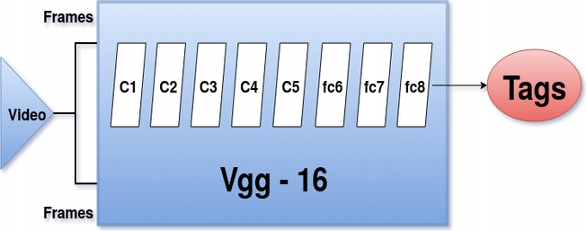
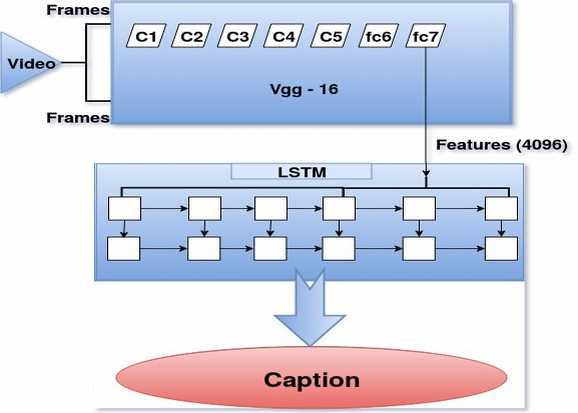

# **Video 2 Text**

This projects tackles the problem of generating tags and caption for decribing videos. 
The motivation for the project was the huge amounts of video data available on different websites (youtube, facebook, twitter, imdb etc.). 
But there is no real end to end system that can generate tags or captions for videos. 
These tags and captions could be leveraged in building better recommnedation systems for video, video search, video summarization etc.

## **Pre processing and Data**

The data set used are:
1) IageNet dataset - which contains 1.2 million images from 1000 classes.
The dataset can be found [here](http://image-net.org/download-images).

2) Youtube video dataset - which contains ~2k videos (10 second - 25 second clips) with multiple captions describing them.

	The videos in the dataset were sampled into frames which were resized into 224*224.
The imagenet data set can be used to pre train VGG-16 model and store the weights.
The weight can be reloded into the model for computation later. You can read more about VGG model [here](http://www.robots.ox.ac.uk/~vgg/research/very_deep/).
The weight loading part is done using the vgg16.py file.
Also, a vocab is created over all the clean captions present for the videos.

## **Models**

## **Training**

For generation of tags the pre-trained model is used to generate tags for the sampled frames. The output tags are the top 5-10 tags with highest probability amongst all the frames. It is possible to further train the Vgg model by setting the layers to be trainable and then training it on new data.

For generation of captions features are extracted from the Fc7 layer of Vgg and fed into the lstm network. The lstm network is trained using captions represented as one hot encoding over the vocab created. You can use file test.py to do train the lstm. For training vgg modify and use the vgg.16 or caption1.py file.

## **Testing**

	In order to run the flask webapp, do
	> python run.py
	This will start the flask server on localhost:5000. 
You can then upload a video using the webapp, which will then output the tags and caption for the video using the saved trained model (generated using test.py file). 
The latency is about 30-60 seconds.

## **Demo and Presentation**

You can find a example video [here](https://www.youtube.com/watch?v=l2uLcy_FafA), and the demo of webapp for the video [here](https://www.youtube.com/watch?v=XFgfrWsTRxU).

You can also find the project presentation slides [here](https://www.goo.gl/sNZZZH).

### **References**

1) Vgg-16 [link](http://www.robots.ox.ac.uk/~vgg/research/very_deep/).
2) Very Deep Convolutional Network for large scale image recognition [link](https://arxiv.org/pdf/1409.1556.pdf).
3) Show and Tell [link](https://arxiv.org/pdf/1411.4555.pdf).
